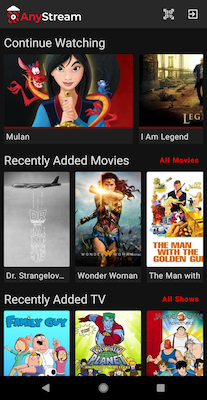
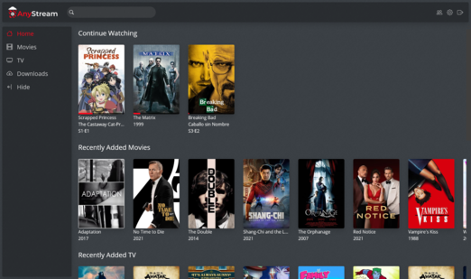

<h1 align="center">AnyStream</h1>
<h3 align="center">A self-hosted streaming service for your media collection.</h3>

---

### Learn more at [docs.anystream.dev](https://docs.anystream.dev)

### Features

- Track and organize your existing media library
- Stream to all your favorite devices
- Securely share your library with friends and family
- Find missing and newly released content for your collection

Screenshots

### Project Structure

- [server](server) &mdash; Web server for managing and streaming media built with [Ktor](https://github.com/ktorio/ktor)
- [client/data-models](client/data-models) &mdash; Data models shared between the server and clients
- [client/core](client/core) &mdash; Multiplatform infrastructure for AnyStream client applications built with [Mobius.kt](https://github.com/DrewCarlson/mobius.kt)
- [client/web](client/web) &mdash; Web client implementation built with [Compose HTML](https://github.com/JetBrains/compose-multiplatform#libraries)
- [client/ui](client/ui) &mdash; Shared [Compose Multiplatform](https://github.com/JetBrains/compose-multiplatform/) UI for Mobile & Desktop
- [client/android](client/android) &mdash; Android client implementation built with [Jetpack Compose](https://developer.android.com/jetpack/compose)
- [client/ios](client/ios) &mdash; iOS client implementation built with [Compose Multiplatform](https://github.com/JetBrains/compose-multiplatform/) & [SwiftUI](https://developer.apple.com/xcode/swiftui/)
- [client/desktop](client/desktop) &mdash; Experimental Desktop client implementation with [Compose Multiplatform](https://github.com/JetBrains/compose-multiplatform/)

### Development Setup

- Install [Intellij IDEA](https://www.jetbrains.com/idea/) (preferred) or [Android Studio](https://developer.android.com/studio/)
- (macOS) Install [Xcode](https://developer.apple.com/xcode/) and command line tools `xcode-select --install`
- Clone this repo `git clone https://github.com/DrewCarlson/AnyStream.git`
- Open the `AnyStream` folder in your IDE

### License

This project is licensed under AGPL-3.0, found in [LICENSE](LICENSE).
