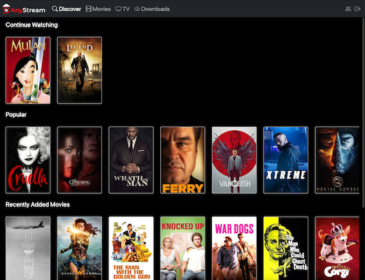

<h1 align="center">AnyStream</h1>
<h3 align="center">A self-hosted streaming service for your media collection.</h3>

---

<p align="center">

<a href="https://github.com/DrewCarlson/AnyStream/pkgs/container/anystream" style="text-decoration: none !important;">

</a>
<a href="https://raw.githubusercontent.com/DrewCarlson/AnyStream/main/LICENSE" style="text-decoration: none !important;">

</a>

<a href="https://github.com/drewcarlson/AnyStream/releases/lagest" style="text-decoration: none !important;">

</a>
</p>

### Features

- Track and organize your existing media library
- Stream to all your favorite devices
- Share your library with fine-grained permissions

<details>
<summary>Screenshots</summary>




</details>

### Structure

- [anystream-server](anystream-server) &mdash; Web server for managing and streaming media built with [Ktor](https://github.com/ktorio/ktor)
- [anystream-data-models](anystream-data-models) &mdash; Data models shared between the server and clients
- [anystream-client-core](anystream-client-core) &mdash; Multiplatform infrastructure for AnyStream client applications built with [Mobius.kt](https://github.com/DrewCarlson/mobius.kt)
- [anystream-client-api](anystream-client-api) &mdash; Multiplatform API client for interacting with the server built with [Ktor-client](https://github.com/ktorio/ktor)
- [anystream-client-android](anystream-client-android) &mdash; Android client implementation built with [Jetpack Compose](https://developer.android.com/jetpack/compose)
- [anystream-client-web](anystream-client-web) &mdash; Web client implementation built with [Jetbrains Compose](https://github.com/JetBrains/compose-jb/)

### Development

- Install [Intellij IDEA](https://www.jetbrains.com/idea/) (preferred) or [Android Studio](https://developer.android.com/studio/)
- Clone this repo `git clone https://github.com/DrewCarlson/AnyStream.git`
- Open the `AnyStream` folder in your IDE

### Run locally

1. Build server `./gradlew installShadowDist`

2. Build client-web `./gradlew jsBrowserDistribution`

3. Start docker stack `docker-compose up -d`

The following services will be running:

- anystream (app): http://localhost:8888
- mongo: localhost:27017
- docker-qbittorrentvpn: http://localhost:9090


### Web Client Development

1. _(Follow Run Locally)_

2. Run the client-web webpack dev server: `./gradlew -t jsBrowserRun`
   
The web client with live-reload is served from http://localhost:3000.
Webpack's dev server proxies API requests to `localhost:8888`.


### Server Development

1. _(Follow Run Locally)_

2. Stop the AnyStream container: `docker-compose stop app`

3. Run the server: `./gradlew -t run`


### Other useful tasks

Build server bundle into `anystream-server/build/install/server-shadow`:
```bash
./gradlew installShadowDist
```

Build production client-web source into `anystream-client-web/build/distributions`:
```bash
./gradlew jsBrowserDistribution
```

### License

This project is licensed under AGPL-3.0, found in [LICENSE](LICENSE).
